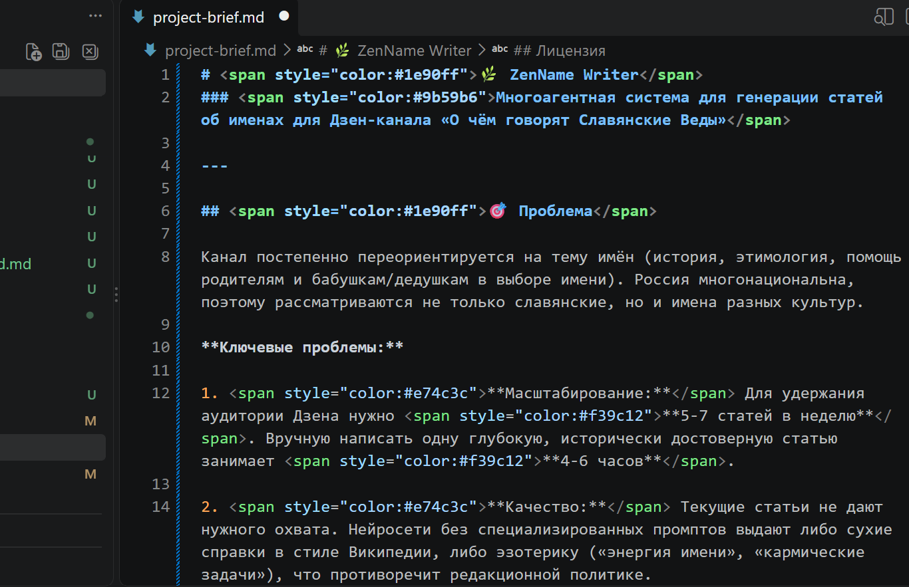

# 🌿 ZenName Writer
### Многоагентная система для генерации статей об именах для Дзен-канала «О чём говорят Славянские Веды»

---

## 🎯 Проблема

Канал постепенно переориентируется на тему имён (история, этимология, помощь родителям и бабушкам/дедушкам в выборе имени). Россия многонациональна, поэтому рассматриваются не только славянские, но и имена разных культур.

**Ключевые проблемы:**

1. **Масштабирование:** Для удержания аудитории Дзена нужно **5-7 статей в неделю**. Вручную написать одну глубокую, исторически достоверную статью занимает **4-6 часов**.

2. **Качество:** Текущие статьи не дают нужного охвата. Нейросети без специализированных промптов выдают либо сухие справки в стиле Википедии, либо эзотерику («энергия имени», «кармические задачи»), что противоречит редакционной политике.

3. **Отсутствие обратной связи:** Нет системного механизма анализа опубликованного контента для постоянного улучшения стиля и структуры будущих генераций.

---

## 👥 Пользователь

- **Основной пользователь:** Автор и редактор канала.
- **Целевая аудитория канала:** Взрослые люди **45-50+**, родители, бабушки и дедушки, интересующиеся историей, культурой и осмысленным выбором имени для ребёнка.
- **Вторичные «пользователи»:** **9 специализированных ИИ-агентов**, которые взаимодействуют друг с другом через систему промптов.

---

## ⚙️ Основная функция

Сервис выполняет **три ключевые задачи**:

### 1. Генерация статьи
На вход подаётся имя или тема. На выходе — готовая SEO-оптимизированная статья в формате Markdown (**4000-8000 знаков**), строго соответствующая редакционной политике канала: историческая достоверность, отсутствие эзотерики, специфическая структура, живой и тёплый тон, сенсорные детали.

### 2. Генерация визуального контента
Агент «Фото-директор» анализирует статью и создаёт промты для нейросетей (Midjourney, Kandinsky, Flux) в **эстетике Тарковского** — с жёсткими запретами на грязь, обшарпанность и азиатскую внешность.

### 3. Анализ и обратная связь (Feedback Loop)
На вход подаётся текст опубликованной статьи. ИИ анализирует её и выдаёт конкретные рекомендации по улучшению стиля, структуры или подачи. Эти рекомендации встраиваются в промпты для следующих генераций.

---

## 🏗 Архитектура системы

Проект построен по принципу **многоагентной системы** (Multi-Agent System). Каждый агент имеет узкую специализацию:

| Агент | Задача |
|-------|--------|
| **Стратег канала** | Хранит ДНК проекта: tone of voice, запреты, портрет аудитории |
| **Автор** | Генерирует первичный черновик с рандомизацией точки входа |
| **Валидатор** | Проверяет текст на эзотерику, клише и маркеры ИИ |
| **SEO-специалист** | Подбирает ключевые слова, теги, мета-описание |
| **Редактор** | Улучшает ритм, убирает повторы |
| **Фото-директор** | Генерирует промты для изображений |
| **Трансформер** | Переписывает сухие факты в живую историю |
| **Оркестратор** | Запускает полный пайплайн за один вызов |
| **Золотой стандарт** | Генерирует длинные структурированные статьи |

---

## 📦 Формат результата

1. **Готовый `.md` файл статьи** с:
   - Креативным вступлением через бытовой предмет-якорь (старая тетрадь, фотография, письмо)
   - Чёткой структурой заголовков (H1, H2, H3)
   - Органичным вплетением учёных через действие («Я нашла том Суперанской в библиотеке...»)
   - Концовкой с вопросом к читателю

2. **SEO-метаданные:** ключевые слова, теги, мета-описание для Дзена.

3. **Промты для фото:** 2-3 детальных промта на английском для генерации изображений.

4. **Текстовый отчёт** с рекомендациями по улучшению будущих промптов.

---

## 🛠 Минимальный функционал (MVP)

### 7 режимов работы в консольном интерфейсе:
1. Быстрый автор (генерация черновика за **2-3 минуты**)
2. Оркестратор (полный пакет: статья + SEO + фото-промты)
3. Редактор (анализ и улучшение готового текста)
4. Трансформер (переписка сухого текста в живую историю)
5. Золотой стандарт v2 (длинные статьи **4000+ знаков**)
6. Выход
7. Фото-директор (генерация промтов для изображений)

### Жёсткие правила в промптах:

❌ **Запрет:** «энергия», «карма», «родовые программы», «места силы», эзотерика

✅ **Обязательно:** сенсорные образы, конкретика, бытовой тон, историческая преемственность, учёные через действие

✅ **Эстетика:** стиль Тарковского, ухоженная винтажность, без грязи и обшарпанности

**Сохранение результатов:** локальная папка `output/demos/` с лучшими примерами.

---

## 💻 Технологии

- **Python 3.10+** (основной язык логики)
- **Локальная LLM через Ollama** (модель `qwen2.5:14b` — оптимальный баланс качества и скорости для русского языка)
- **Формат данных:** Markdown (.md) для статей, промптов и отчётов
- **Инструмент разработки:** VS Code + Cline (AI-ассистент для вайб-кодинга)
- **Генерация изображений:** Midjourney / Kandinsky / Flux (по промтам от агента)

---

## 🏆 Результаты и демонстрация

✅ **Опубликованная статья:** [Имя Анна: связь поколений в старой тетради](https://dzen.ru/a/ar09pdb1ZA6Qvl4i)

✅ **Демо-файлы:** папка `output/demos/` содержит **5 примеров** работы разных режимов

✅ **Архив промптов:** папка `prompts/` с **9 специализированными агентами**

✅ **База знаний:** папка `best_examples/` с эталонными текстами для few-shot learning

---

##  Планы развития (Roadmap)

1. **Модуль глубоких исследований (Deep Research & Clustering)**  
   Переход к модели «Хаб и спицы»: один агент генерирует исследование на **10-15 страниц**, второй выделяет **5-10 тем** для статей, третий пишет лонгриды **4000-8000 знаков**.

2. **Итеративное улучшение промптов (Few-Shot Learning)**  
   Еженедельное добавление лучших статей в `best_examples/` как эталоны стиля.

3. **Масштабирование базы знаний**  
   При накоплении **50+ статей** система будет генерировать тексты сразу в целевом Tone of Voice.

4. **Fine-Tuning модели**  
   Дообучение Qwen 2.5 на собственном датасете для «зашивания» стиля канала в веса нейросети.

5. **Полная автоматизация пайплайна**  
   Интеграция с API Дзена и Telegram для автономного конвейера: исследование → статья → фото → постинг.

---

##  Автор

Проект разработан в рамках изучения многоагентных систем, локальных LLM и практического применения вайб-кодинга (vibe-coding) для решения реальных задач контент-маркетинга.

---

##  Лицензия

**MIT**